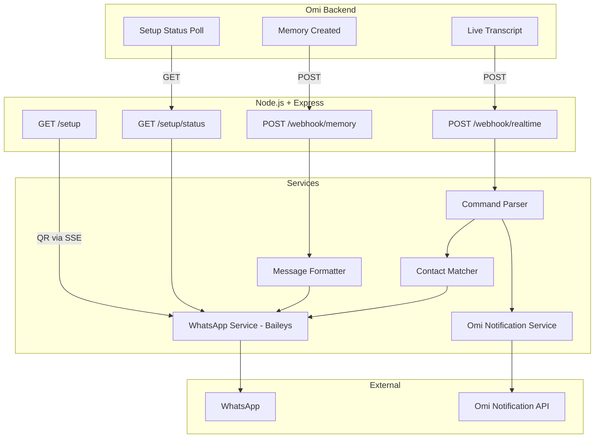

# Omi WhatsApp Integration -- Implementation Plan

The repo currently has only documentation (`docs/prd.md`, `docs/tech-stack.md`) and Cursor rules. No source code, `package.json`, or `tsconfig.json` exists yet. This plan builds the entire MVP from scratch.

## Architecture Overview




## File Structure

```
src/
  index.ts              -- Entry point: Express app, routes, startup
  routes/
    setup.ts            -- GET /setup (QR page), GET /setup/status
    webhook.ts          -- POST /webhook/memory, POST /webhook/realtime
  services/
    whatsapp.ts         -- Baileys connection, QR gen, send message, contacts
    formatter.ts        -- Format Omi memory into WhatsApp recap message
    command-parser.ts   -- Detect "send message to X" in transcript segments
    contact-matcher.ts  -- Fuzzy match name to WhatsApp contact
    notification.ts     -- Send notification back to Omi via their API
  types/
    omi.ts              -- Omi webhook payload types (Memory, TranscriptSegment)
    whatsapp.ts         -- WhatsApp session state types
  views/
    setup.html          -- QR code setup page (SSE-powered)
```

---

## Step 1: Project Scaffolding

Create the foundational project files:

- `**package.json**` -- dependencies from [docs/tech-stack.md](docs/tech-stack.md): `@whiskeysockets/baileys`, `express`, `qrcode`, `dotenv`, `pino`; devDeps: `typescript`, `tsx`, `@types/express`, `@types/qrcode`, `@types/node`. Add scripts: `"dev": "tsx watch src/index.ts"`, `"start": "tsx src/index.ts"`.
- `**tsconfig.json**` -- target ES2022, module NodeNext, moduleResolution NodeNext, strict mode, outDir `dist/`, rootDir `src/`.
- `**.env.example**` -- template with `PORT=3000`, `NGROK_URL=`, `OMI_APP_ID=`, `OMI_APP_SECRET=`, `LOG_LEVEL=info`.
- `**.gitignore**` -- `node_modules/`, `dist/`, `sessions/`, `.env`, `auth_info*/`.
- Run `npm install`.

---

## Step 2: TypeScript Types (`src/types/`)

Define types matching the Omi webhook payloads (from [Omi Integration Docs](https://docs.omi.me/doc/developer/apps/Integrations)):

- `**src/types/omi.ts**` -- `TranscriptSegment` (text, speaker, speakerId, is_user, start, end), `ActionItem` (description, completed), `Structured` (title, overview, emoji, category, action_items, events), `OmiMemory` (id, created_at, started_at, finished_at, transcript_segments, structured, discarded).
- `**src/types/whatsapp.ts**` -- `WhatsAppSession` interface tracking socket, store, connection status, QR code, user JID per uid.

---

## Step 3: WhatsApp Service (`src/services/whatsapp.ts`)

Core Baileys integration -- the most complex piece:

- `**initSession(uid: string): Promise<void>**` -- Create Baileys socket using `useMultiFileAuthState('sessions/{uid}')`, configure with pino logger (level from env). Handle connection events: `connection.update` for QR codes and connection status, `creds.update` to save auth.
- `**getSession(uid: string): WhatsAppSession | undefined**` -- Retrieve active session from in-memory Map.
- `**isConnected(uid: string): boolean**` -- Check if session exists and socket is open.
- `**getQR(uid: string): string | undefined**` -- Return latest QR string for the uid.
- `**sendSelfMessage(uid: string, text: string): Promise<void>**` -- Send message to user's own JID (self-message). The user's JID is available from `socket.user.id` after connection.
- `**sendMessage(uid: string, jid: string, text: string): Promise<void>**` -- Send message to any contact JID.
- `**getContacts(uid: string)**` -- Return contacts from Baileys store for contact matching.
- Store sessions in `Map<string, WhatsAppSession>` keyed by uid.

---

## Step 4: Message Formatter (`src/services/formatter.ts`)

- `**formatMemoryRecap(memory: OmiMemory): string**` -- Build the WhatsApp message using the template from [docs/prd.md](docs/prd.md):
  - Title with emoji, overview (truncated at 500 chars), action items as bullet list (omit section if empty), category, duration (computed from `started_at`/`finished_at`), date.
- Return empty string if `structured` is missing or memory is `discarded`.

---

## Step 5: Command Parser (`src/services/command-parser.ts`)

- `**parseCommand(text: string): { name: string, content: string } | null**` -- Regex-based detection of voice command patterns from the PRD:
  - `send message to {name}: {content}`
  - `send message to {name} saying {content}`
  - `send a message to {name}: {content}`
  - `message {name}: {content}`
  - `text {name}: {content}`
  - `whatsapp {name}: {content}`
- Case-insensitive matching. Returns parsed name and message content, or null if no match.

---

## Step 6: Contact Matcher (`src/services/contact-matcher.ts`)

- `**findContact(contacts: Record<string, Contact>, name: string): { jid: string, name: string } | null**` -- Match logic from the PRD:
  1. Normalize input name (lowercase, trim).
  2. Iterate contacts, compare against `name`, `notify`, `vname`, `short` fields.
  3. Priority: exact match > starts-with > contains.
  4. Return best match JID and display name, or null.

---

## Step 7: Omi Notification Service (`src/services/notification.ts`)

- `**sendNotification(uid: string, message: string): Promise<void>**` -- POST to `https://api.omi.me/v2/integrations/{OMI_APP_ID}/notification?uid={uid}&message={message}` with `Authorization: Bearer {OMI_APP_SECRET}`. Used to confirm "Message sent to John" or report "Contact not found: John" back to the user's Omi app.

---

## Step 8: Setup Routes (`src/routes/setup.ts`)

- `**GET /setup?uid=...**` -- Serve the HTML setup page. On request, call `initSession(uid)` to start Baileys and begin generating QR codes.
- `**GET /setup/status?uid=...**` -- Return `{ is_setup_completed: boolean }` by checking `isConnected(uid)`. This is polled by Omi to know when setup is done.
- `**GET /setup/events?uid=...**` -- SSE endpoint. Push QR code data URLs and connection status updates to the browser in real-time. The setup HTML page connects to this endpoint via `EventSource`.

---

## Step 9: Setup Page (`src/views/setup.html`)

- Single HTML file, no framework. Clean, modern UI with inline CSS.
- On load, connect to `/setup/events?uid=...` via `EventSource`.
- Display QR code image (received as data URL from SSE).
- Show "Scan with WhatsApp" instructions.
- On `connected` event, show green checkmark "WhatsApp connected! You can close this page."

---

## Step 10: Webhook Routes (`src/routes/webhook.ts`)

`**POST /webhook/memory?uid=...**`

1. Parse body as `OmiMemory`.
2. If `discarded === true` or `structured` is empty, return 200 immediately.
3. Call `formatMemoryRecap(memory)` to build the message.
4. Return 200 to Omi immediately (don't block the webhook).
5. Asynchronously call `sendSelfMessage(uid, formattedMessage)`.
6. If WhatsApp session not connected, log warning and skip.

`**POST /webhook/realtime?uid=...&session_id=...**`

1. Parse body as `TranscriptSegment[]`.
2. Deduplicate: maintain `Map<string, Set<number>>` keyed by `session_id`, tracking processed segment start times.
3. For each new segment, concatenate recent text and run `parseCommand()`.
4. If command detected:
  - Get contacts via `getContacts(uid)`.
  - Run `findContact(contacts, name)`.
  - If match: `sendMessage(uid, jid, content)` and `sendNotification(uid, "Message sent to {name}")`.
  - If no match: `sendNotification(uid, "Contact not found: {name}")`.
  - If empty content: `sendNotification(uid, "No message content detected")`.
5. Return 200 immediately.

---

## Step 11: Entry Point (`src/index.ts`)

- Load `.env` via dotenv.
- Create Express app with JSON body parser.
- Mount routes: setup routes at `/setup`, webhook routes at `/webhook`.
- Start listening on `PORT` (default 3000).
- Log startup info with pino.

---

## Step 12: Update `docs/architecture.md`

Per project rules, update the architecture doc after completing the milestone. Document the file structure, data flow, and key design decisions.

---

## Key Omi Integration Details

- **Memory webhook** receives the full memory object as JSON body with `?uid=` query param. The `structured` field has everything needed -- no LLM required.
- **Real-time webhook** receives `TranscriptSegment[]` as JSON body with `?uid=` and `?session_id=` query params. Segments arrive incrementally as the conversation unfolds.
- **Setup status** must return exactly `{ "is_setup_completed": boolean }` -- Omi polls this.
- **Notifications** use `POST https://api.omi.me/v2/integrations/{app_id}/notification?uid=...&message=...` with Bearer token auth.
- Return 200 quickly from all webhooks; do async work after responding.

